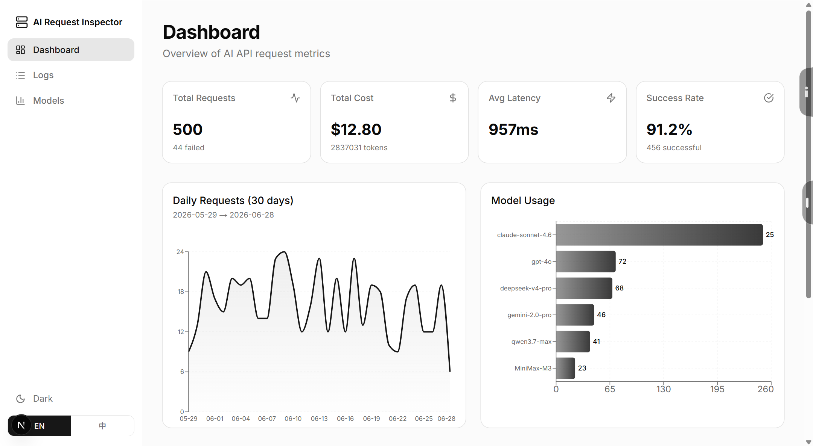
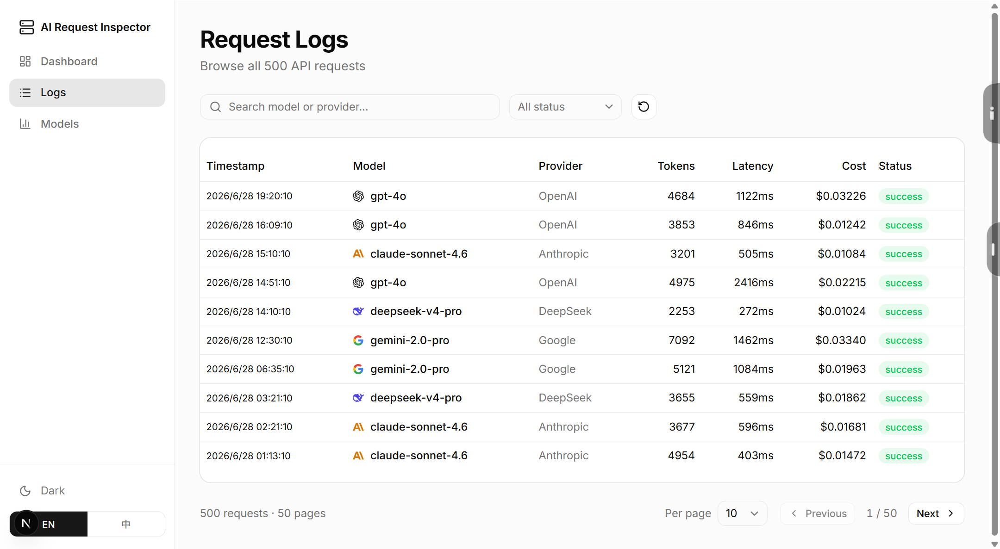
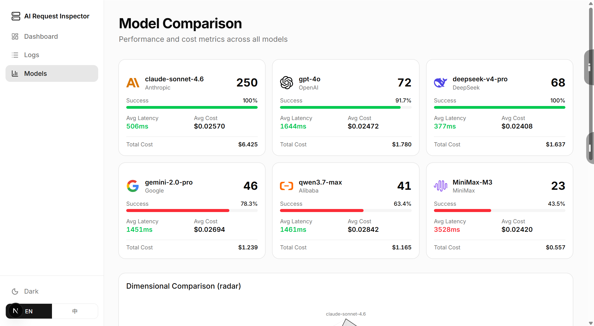

# AI Request Inspector

A full-stack demo dashboard for monitoring and analyzing AI API request metrics. Built to showcase frontend + backend development skills.

## Tech Stack

| Layer | Technology |
|-------|-----------|
| Frontend | Next.js 16 (App Router), TypeScript, Tailwind CSS, shadcn/ui |
| Charts | Recharts (area, bar, radar) |
| Backend | FastAPI (Python) |
| Database | SQLite |
| Data | 500 simulated records across 6 AI models |

## Features

- **Dashboard** — KPI cards (total requests, cost, latency, success rate), daily trend area chart, model usage bar chart, recent requests
- **Request Logs** — Paginated table with search, status/model filter, per-page selector (10/20/50)
- **Model Comparison** — Per-model cards with success rate bar, latency color coding, radar chart, latency bar chart
- **Multi-language** — English / Chinese toggle
- **Theme** — Dark / Light mode toggle
- **Back-to-top** — Floating scroll-to-top button

## Getting Started

```bash
cd frontend
npm install
npm run dev
```

Open `http://localhost:3000` — the app auto-redirects to `/dashboard`.

The API routes (`/api/summary`, `/api/logs`, `/api/models`) are built into Next.js — no separate backend needed.

## API Endpoints

| Method | Endpoint | Description |
|--------|----------|-------------|
| GET | `/api/summary` | Overview stats + chart data + recent requests |
| GET | `/api/logs` | Paginated logs with filters (`?page=&status=&model=&q=`) |
| GET | `/api/models` | Per-model aggregated metrics |

## Project Structure

```
ai-request-inspector/
├── frontend/
│   └── src/
│       ├── app/
│       │   ├── api/
│       │   │   ├── summary/route.ts   # GET /api/summary
│       │   │   ├── logs/route.ts      # GET /api/logs
│       │   │   └── models/route.ts    # GET /api/models
│       │   ├── layout.tsx             # Root layout + providers
│       │   ├── dashboard/page.tsx     # KPI cards + area/bar charts
│       │   ├── logs/page.tsx          # Paginated table + filters
│       │   └── models/page.tsx        # Model cards + radar/bar charts
│       ├── components/
│       │   ├── sidebar.tsx            # Navigation + theme/lang toggles
│       │   ├── theme-provider.tsx     # Dark/light theme context
│       │   ├── provider-logo.tsx      # Brand logo component
│       │   ├── back-to-top.tsx        # Scroll-to-top button
│       │   └── ui/                    # shadcn/ui components
│       ├── lib/
│       │   ├── api.ts                 # API client
│       │   ├── seed-data.ts           # 500 simulated records
│       │   ├── i18n.ts                # EN/ZH dictionary
│       │   └── i18n-context.tsx       # Multi-language provider
│       └── ...
├── README.md                          # English
├── README.zh-CN.md                    # 中文
├── screenshots/                       # Demo screenshots
└── public/logos/                      # Brand SVG logos
```

## Screenshots

| Dashboard | Request Logs | Model Comparison |
|:---:|:---:|:---:|
|  |  |  |
