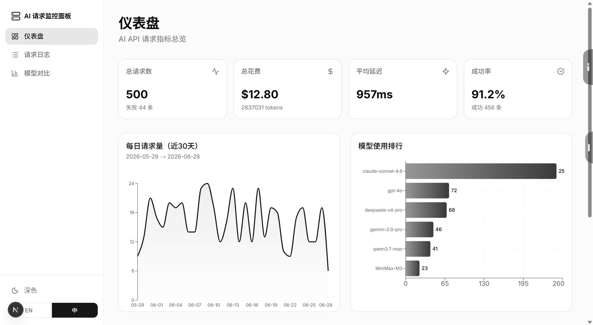
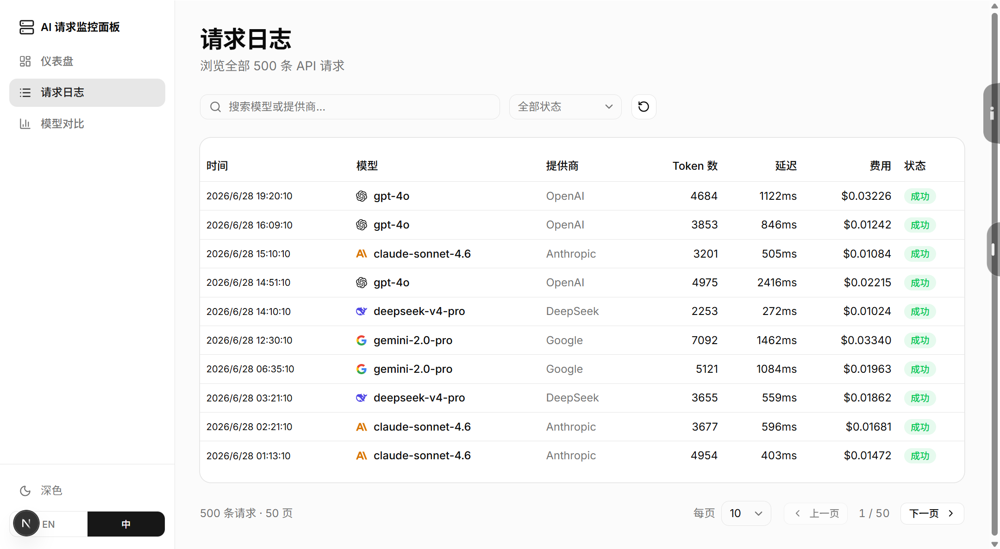
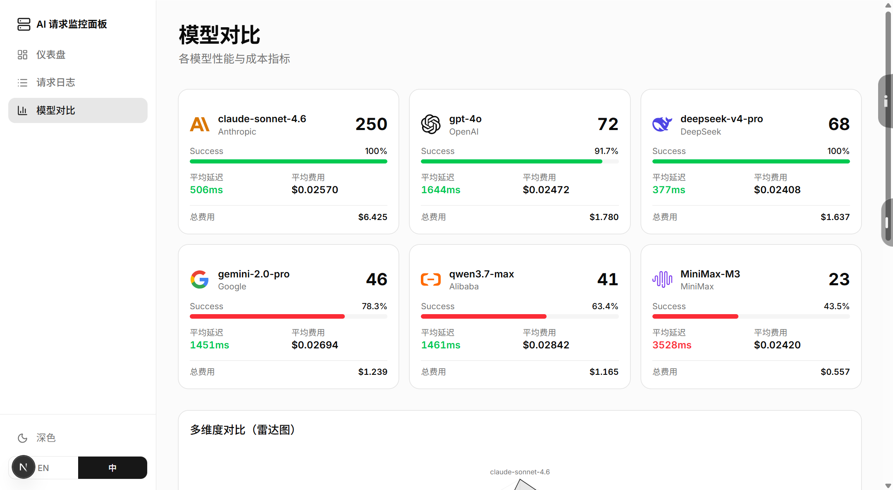

# AI Request Inspector（AI 请求监控面板）

一个全栈仪表盘 Demo，用于监控和分析 AI API 请求指标。展示前后端开发能力。

## 技术栈

| 层 | 技术 |
|----|------|
| 前端 | Next.js 16 (App Router), TypeScript, Tailwind CSS, shadcn/ui |
| 图表 | Recharts（面积图、柱状图、雷达图） |
| 后端 | FastAPI (Python) |
| 数据库 | SQLite |
| 数据 | 500 条模拟记录，覆盖 6 个 AI 模型 |

## 功能

- **仪表盘** — KPI 卡片（总请求数、花费、延迟、成功率）、每日趋势面积图、模型用量柱状图、最近请求
- **请求日志** — 分页表格、搜索、状态/模型筛选、每页条数选择（10/20/50）
- **模型对比** — 模型指标卡片（成功率进度条、延迟颜色编码）、雷达图、延迟对比柱状图
- **多语言** — 英文 / 中文 一键切换
- **换肤** — 深色 / 浅色 主题切换
- **回到顶部** — 浮动按钮，滚动后显示

## 启动方式

### 在线 Demo

[https://ai-request-inspector.vercel.app](https://ai-request-inspector.vercel.app)

### 本地运行

```bash
cd frontend
npm install
npm run dev
```

打开 `http://localhost:3000`，自动跳转到 `/dashboard`。

API 路由 (`/api/summary`、`/api/logs`、`/api/models`) 集成在 Next.js 中，无需独立后端。

## API 接口

| 方法 | 路径 | 说明 |
|------|------|------|
| GET | `/api/summary` | 总览统计 + 图表数据 + 最近请求 |
| GET | `/api/logs` | 分页日志，支持筛选（`?page=&status=&model=&q=`）|
| GET | `/api/models` | 各模型聚合指标 |

## 项目结构

```
ai-request-inspector/
├── frontend/
│   └── src/
│       ├── app/
│       │   ├── api/
│       │   │   ├── summary/route.ts   # GET /api/summary
│       │   │   ├── logs/route.ts      # GET /api/logs
│       │   │   └── models/route.ts    # GET /api/models
│       │   ├── layout.tsx             # 根布局 + Provider
│       │   ├── dashboard/page.tsx     # KPI 卡片 + 面积/柱状图
│       │   ├── logs/page.tsx          # 分页表格 + 筛选
│       │   └── models/page.tsx        # 模型卡片 + 雷达/柱状图
│       ├── components/
│       │   ├── sidebar.tsx            # 导航 + 主题/语言切换
│       │   ├── theme-provider.tsx     # 深浅色主题 Context
│       │   ├── provider-logo.tsx      # 品牌 Logo 组件
│       │   ├── back-to-top.tsx        # 回到顶部按钮
│       │   └── ui/                    # shadcn/ui 组件
│       ├── lib/
│       │   ├── api.ts                 # API 调用封装
│       │   ├── seed-data.ts           # 500 条模拟数据
│       │   ├── i18n.ts                # 中英文翻译字典
│       │   └── i18n-context.tsx       # 多语言 Provider
│       └── ...
├── README.md                          # 英文
├── README.zh-CN.md                    # 中文
├── screenshots/                       # 截图
└── public/logos/                      # 品牌 logo 图标
```

## 截图

| 仪表盘 | 请求日志 | 模型对比 |
|:---:|:---:|:---:|
|  |  |  |
